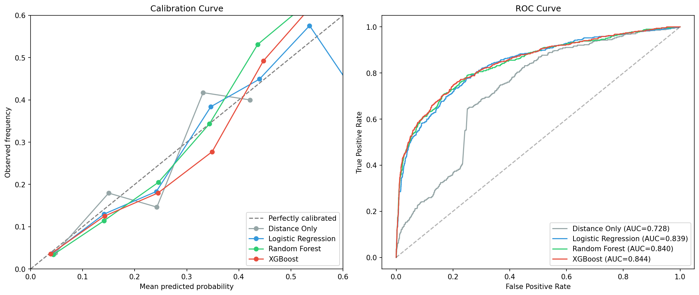

# Expected Goals (xG) Model

An expected goals model built from scratch using [StatsBomb open data](https://github.com/statsbomb/open-data). Predicts the probability that a football shot becomes a goal based on 36 engineered features — no player or team identity in training.

## Results

**Model comparison on international tournament test set** (World Cup 2022, Euro 2024, Women's World Cup 2023):

| Model | Log Loss | Brier Score | AUC-ROC |
|---|---|---|---|
| Distance Only | 0.3166 | 0.0927 | 0.728 |
| Logistic Regression | 0.2569 | 0.0727 | 0.839 |
| Random Forest | 0.2526 | 0.0706 | 0.840 |
| **XGBoost** | **0.2482** | **0.0693** | **0.844** |

The model is trained on club football (La Liga, Premier League, Bundesliga, etc.) and tested on international tournaments to demonstrate genuine generalisation.

### Calibration



### Key findings

- **Distance and angle dominate** — the geometry of the shot is the strongest predictor (SHAP analysis)
- **Freeze frame features add value** — defenders in the shot cone and goalkeeper distance improve predictions beyond location alone
- **The universal model generalises across leagues** — a single model trained on all competitions calibrates well for each individually; league-specific models offer marginal improvement at best
- **Men's vs Women's football differs structurally** — women's football produces chances from closer range with wider angles and fewer defenders in the cone, but the model calibrates well for both
- **Elite finishers consistently outperform xG** — the gap between goals and xG captures genuine finishing skill that the model (correctly) doesn't try to learn

## Features (36 total)

**Location (4):** Distance to goal, visible angle, distance to nearest post, off-centre displacement

**Shot (14):** Body part (head/left/right foot), technique (volley, half-volley, lob, overhead kick, backheel, diving header), first time, under pressure, one-on-one, open goal, deflected, follows dribble, redirect

**Situation (9):** Penalty, free kick, play pattern (open play, corner, counter attack, free kick, throw-in, goal kick, keeper distribution)

**Game state (3):** Minute, second half, last 15 minutes

**Freeze frame (4):** Defenders in the shot-to-goal cone, opponents between shot and goal, goalkeeper distance, goalkeeper angle coverage

**Deliberately excluded:** Player name, team name, opponent. The model learns *what makes a good chance*, not *who takes it*. Player identity is brought back at analysis time to find over/underperformers.

## Project structure

```
src/
  data_collection/    StatsBomb API client, pulls all shot events
  features/           Feature engineering pipeline (36 features)
  models/             Model training (4 models, train/test by competition)
  evaluation/         Metrics, calibration curves, SHAP analysis
notebooks/
  01_eda.ipynb                 Data exploration and pitch visualisations
  02_feature_engineering.ipynb Feature distributions and correlations
  03_modelling.ipynb           Model comparison, calibration, SHAP
  04_analysis.ipynb            League analysis, men's/women's, player xG
tests/
  test_features.py             19 unit tests for feature calculations
```

## Quick start

```bash
# Setup
python -m venv venv && source venv/bin/activate
pip install -r requirements.txt

# Run the full pipeline
make data        # Pull shots from StatsBomb (takes ~15 min)
make features    # Engineer 36 features
make train       # Train 4 models with 5-fold CV
make evaluate    # Evaluate on test set, generate plots

# Or run everything
make all

# Run tests
make test
```

### Docker

```bash
docker build -t xg-model .
docker run xg-model
```

## Data

**88,023 shots** across 21 competitions from StatsBomb open data:
- La Liga (18 seasons), Premier League, Serie A, Ligue 1, Bundesliga
- FIFA World Cup (2018, 2022 + historical), UEFA Euro, Copa America
- FA Women's Super League, Women's World Cup, UEFA Women's Euro, NWSL
- Champions League (18 seasons), and more

**9,790 goals** — 11.1% base rate. This class imbalance is why accuracy is the wrong metric; a model predicting "no goal" every time gets 89% accuracy. Log loss and calibration are what matter for probability estimation.

## Evaluation philosophy

- **Log loss** is the primary metric — it directly penalises overconfident wrong predictions
- **Brier score** measures calibration: if the model says "30% chance", ~30% of those shots should be goals
- **AUC-ROC** measures discrimination: can the model distinguish good chances from bad ones?
- **Train/test split by competition**, not random — no data leakage, tests genuine generalisation
- **Calibration curves** are the single most important visualisation for a probability model

## Limitations

- The model doesn't capture goalkeeper quality or detailed defensive positioning beyond the freeze frame
- Shot placement (where in the goal the shot is aimed) is not included — that would be a post-shot xG model
- StatsBomb's own xG model likely uses proprietary features and more sophisticated spatial analysis
- Some competitions have limited data (Champions League has only final-round matches in open data)

## Tech stack

Python, Pandas, Scikit-learn, XGBoost, SHAP, mplsoccer, Matplotlib, Seaborn, statsbombpy, pytest, Docker
